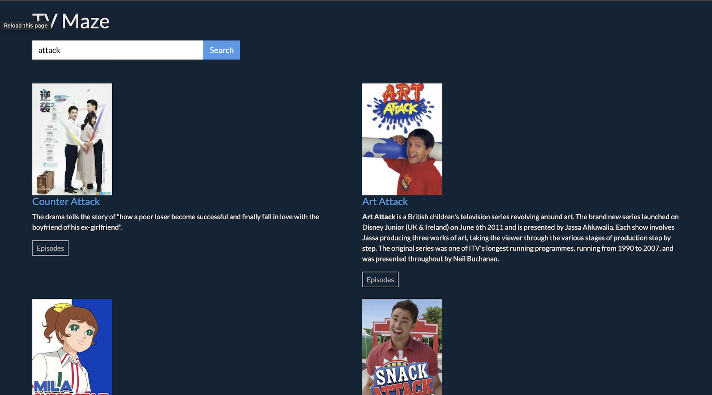

#Tv-maze - TV Show Episode Search

Tv-maze is a TypeScript and vanilla HTML web application that utilizes a third-party API to retrieve information about episode lists of TV shows based on user search queries. The application's search bar allows users to input their queries, and the response is rendered with the show image, title, and description of the show. Additionally, the application features an "Episodes" button, which displays the episode name, season number, and episode number when clicked.

### Getting Started
- To get started with the Tv-maze application, simply clone or download the repository to your local machine. Then, open the index.html file in your web browser.

### Usage
- To search for a TV show, simply enter the name of the show in the search bar and click the "Search" button. The application will then display the show image, title, and description of the show.

- If you would like to see the episode list for a particular season, click the "Episodes" button. The application will then display the episode name, season number, and episode number for each episode in the season.

### API
- The Tv-maze application utilizes the TVmaze API to retrieve information about TV shows and episodes. The API is free to use, but rate-limited to 20 requests per 10 seconds.

### Technologies Used
The Tv-maze application is built using the following technologies:

- TypeScript
- HTML
- CSS
- TVmaze API
